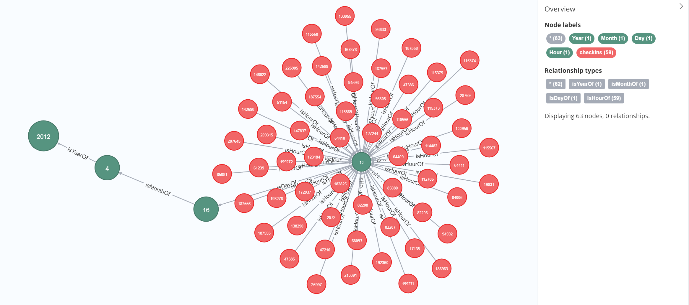
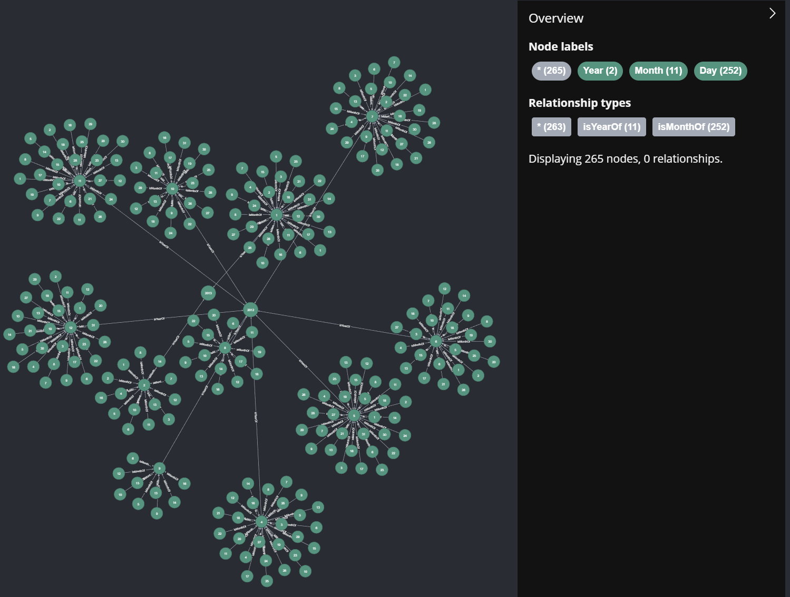
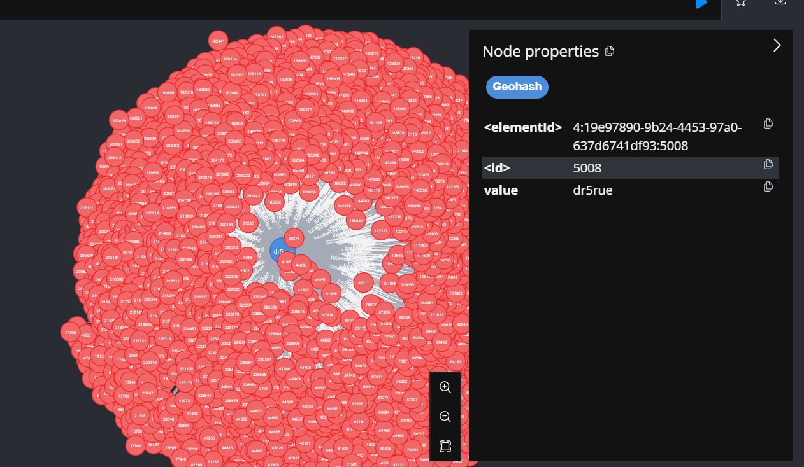

# GraST: Geospatial-Temporal Semantic Query Optimization Framework


[](https://opensource.org/licenses/Apache-2.0)
[](https://neo4j.com/download-center/)
[](https://neo4j.com/download-center/)
[](https://www.postgresql.org/download/)

## Introduction

GraST is a high-performance framework for managing and querying geospatial-temporal data in graph databases. It achieves efficient querying by structurally storing geographic entities in both graph databases and relational databases, and performing data mapping and SQL conversion.

GraST currently supports Neo4j and PostgreSQL (with PostGIS extension). Please ensure these databases are installed before using GraST.

## Features & Advantages

- 🌉 Hybrid storage leveraging both graph and relational databases
- 🗺️ Efficient spatiotemporal indexing (MTT and Geohash)
- 🔧 Custom geospatial-temporal function mapping
- 🔍 Support for complex semantic queries with spatiotemporal constraints
- 🔌 Easy integration with existing systems

## Project Directory
- `GraST-Java`: GraST's core component, built on Maven, including geographic entity mapping across data, and conversion of Cypher queries to SQL queries
- `Data-Importer`: Import geographic entities synchronously into graph and relational databases and build indexes, based on FastAPI


## Supported Geographic Calculation Functions

GraST (Graph Storage) currently supports the following geographic calculation functions for analyzing spatial relationships and performing geographic computations:

- `GraST.within(EntityLabel_A, IDs_A, EntityLabel_B, IDs_B)`: Entity A within Entity B. Return id1, id2

- `GraST.knn(EntityLabel_A, IDs_A, EntityLabel_B, IDs_B, num)`: The K nearest neighbor entities B of entity A. `num` specifies the number of neighbors. Return id1, id2, distance

- `GraST.withinDistance(EntityLabel_A, IDs_A, distance, EntityLabel_B, IDs_B)`: Entity B is within the specified "distance" of entity A. `distance` specified distance of A to B. Return id1, id2

- `GraST.contains(EntityLabel_A, IDs_A, EntityLabel_B, IDs_B)`: Entity A contains Entity B. Return id1, id2

- `GraST.coveredby(EntityLabel_A, IDs_A, EntityLabel_B, IDs_B)`: Entity A coveredby Entity B. Return id1, id2

- `GraST.covers(EntityLabel_A, IDs_A, EntityLabel_B, IDs_B)`: Entity A covers Entity B. Return id1, id2

- `GraST.crosses(EntityLabel_A, IDs_A, EntityLabel_B, IDs_B)`: Entity A crosses Entity B. Return id1, id2

- `GraST.disjoint(EntityLabel_A, IDs_A, EntityLabel_B, IDs_B)`: Entity A disjoint Entity B. Return id1, id2

- `GraST.equals(EntityLabel_A, IDs_A, EntityLabel_B, IDs_B)`: Entity A equals Entity B. Return id1, id2

- `GraST.intersects(EntityLabel_A, IDs_A, EntityLabel_B, IDs_B)`: Entity A intersects Entity B. Return id1, id2

- `GraST.overlaps(EntityLabel_A, IDs_A, EntityLabel_B, IDs_B)`: Entity A overlaps Entity B. Return id1, id2

- `GraST.touches(EntityLabel_A, IDs_A, EntityLabel_B, IDs_B)`: Entity A touches Entity B. Return id1, id2

- `GraST.length(EntityLabel_A, IDs_A)`: Calculate the length of entity A. Return id1, length

- `GraST.value(EntityLabel_A, IDs_A, RasterLabel)`: The value of the raster "RasterLabel" at the location of entity A. Return id1, raster_value


Parameters

- `EntityLabel_A`, `EntityLabel_B`: Strings representing the labels for the geographic entities.
- `IDs_A`, `IDs_B`: Arrays of IDs for the geographic entities. Support passing a single ID or multiple IDs. If an empty array is passed, the operation will be performed on the entire table.
- `RasterLabel`: String representing the label for the raster layer.
- `num`, `distance`: Numeric parameters for the `knn` and `withinDistance` functions, respectively.

See the Query Examples section at the end of the README for specific usage steps and sample queries using GraST functions.


## How to use? add GraST Library Extension to Neo4j

1. Copy `GraST.jar` and `database.properties` from [Link](https://github.com/GeospatialKG/GraST/releases)
2. Paste them into the `\plugins` folder of your Neo4j installation.
3. Define the PostGIS connection information in `database.properties`:
4. Open `neo4j.conf` and set the permissions for `dbms.security.procedures` (official way to enable plugin permissions):
```
dbms.security.procedures.unrestricted=....,GraST.*
dbms.security.procedures.allowlist=....,GraST.*
```
5. Using `GraST Data Importer` and import the geographic data before querying. See the next section for steps.

## Geospatial Data Importer Installation
The data importer is located in the /Data-Importer folder of the project source code and is built based on Python.

To install the required dependencies, run the following command:

```
pip install fastapi uvicorn staticfiles pygeohash geopandas pandas neo4j sqlalchemy geoalchemy2 psycopg2 gdal==3.8.4 numpy==1.26.4
```

Please note that we recommend using the specified versions for GDAL (3.8.4) to ensure compatibility.

If the installation of GDAL fails, you can manually download the appropriate wheel file from https://github.com/cgohlke/geospatial-wheels/releases and install it offline. For example:

```
pip install .\GDAL-3.8.2-cp310-cp310-win_amd64.whl
```

## Geospatial Data Importer Tutorial

1. Navigate to the `Data-Importer` directory
2. Start the FastAPI server: `uvicorn main:app --reload --timeout-keep-alive`
3. Open your web browser and navigate to `http://127.0.0.1:8000` to access the GraST data importer.

Please note:
- For vector data, compress the `.shp`, `.dbf`, and other files into a ZIP file and upload it using the Data Importer. Three sample files are provided in the `Datasets` directory: `borough.zip`, `check-ins.zip`, and `NY_POIs.zip`.<br>


- For raster data, simply upload the `.tif` file.<br>

| Vector data import             | Raster data import              |
|:-------------------------------|:--------------------------------|
|  |  |


## Query Examples using GraST

| Datasets                                                                                                                                                                                                                                                                                                                                                                                                                                                                                                | Entity Label                      |
|:--------------------------------------------------------------------------------------------------------------------------------------------------------------------------------------------------------------------------------------------------------------------------------------------------------------------------------------------------------------------------------------------------------------------------------------------------------------------------------------------------------|:----------------------------------|
| - Landsat 32-Day NDVI Composite: `Landsat_NDVI` [Link](https://github.com/GeospatialKG/GraST/tree/main/Data-importer/Datasets)<br>- NYC Borough Boundaries: `NY_Borough`[Link](https://github.com/GeospatialKG/GraST/tree/main/Data-importer/Datasets)<br>- FourSquare NYC Check-ins: `checkins` [Link](https://github.com/GeospatialKG/GraST/tree/main/Data-importer/Datasets)<br>- New York Road Data: `Roads` [Link](https://github.com/GeospatialKG/GraST/tree/main/Data-importer/Datasets)         |  |

Next, we will demonstrate geospatial-temporal queries in Neo4j based on these datasets.


## Queries

### Calculate the area of each borough
```cypher
CALL GraST.area('NY_Borough', [])
```
<br><br>


### Find roads within the borough with ID=1
```cypher
CALL GraST.within("Roads", [], "NY_Borough", [1])
```
<br>

### Find check-ins within 100 units of a specific road (ID=1)
```cypher
CALL GraST.withinDistance("checkins", [], 100, "Roads", [1])
```
<br>

### Find roads contained by the borough with ID=1
```cypher
CALL GraST.contains("NY_Borough", [1], "Roads", [])
```
<br>


### Find the 100 nearest check-ins to the check-in with ID=1
```cypher
CALL GraST.knn("checkins", [1], "checkins", [], 100)
```
<br>

### Find check-ins covered by the borough with ID=1
```cypher
CALL GraST.coveredby("checkins", [], "NY_Borough", [1])
```
<br>

### Find entities covered by the borough with ID=1
```cypher
CALL GraST.covers("NY_Borough", [1], "checkins", [])
```
<br>

### Find boroughs crossed by the road with ID=4527
```cypher
CALL GraST.crosses("Roads", [4527], "NY_Borough", [])
```
<br>

### Find boroughs disjoint from the road with ID=4527
```cypher
CALL GraST.disjoint("Roads", [4527], "NY_Borough", [])
```
<br>

### Find roads equal to the road with ID=4527
```cypher
CALL GraST.equals("Roads", [4527], "Roads", [])
```
<br>

### Find roads intersecting with the road with ID=4527
```cypher
CALL GraST.intersects("Roads", [4527], "Roads", [])
```
<br>

### Find boroughs overlapping with the borough with ID=3
```cypher
CALL GraST.overlaps("NY_Borough", [3], "NY_Borough", [])
```
<br>

### Find boroughs touching the borough with ID=5
```cypher
CALL GraST.touches("NY_Borough", [5], "NY_Borough", [])
```
<br>

### Calculate the perimeter of the borough with ID=5
```cypher
CALL GraST.length("NY_Borough", [5])
```
<br>

### Calculate the total distance from check-in 1 to 2 to 3 to 4 to 5
```cypher
CALL GraST.distance("checkins", [1,2,3,4,5])
```
<br>

### Query the NDVI values at check-ins with IDs 1, 2, 3, 4, and 5
```cypher
CALL GraST.value("checkins", [1,2,3,4,5], "Landsat_NDVI")
```
<br>

### Query all check-in nodes from 10:00 to 11:00 on April 16, 2012
```cypher
MATCH (y:Year {value: 2012})<-[:isYearOf]-(m:Month {value: 4})<-[:isMonthOf]-(d:Day {value: 16})<-[:isDayOf]-(h:Hour {value: 10})<-[:isHourOf]-(c:checkins)
RETURN y, m, d, h, c
```
<br>

## Geospatial Data Graph Index Organization

| Graph Index                           | resources                           |
|:--------------------------------------|:------------------------------------|
| MTT Index (expanded to Day node only) |  |
| Geohash Index (drur5e as an example)  |    |


## GraST Development and Contributing

We welcome contributions to GraST! If you'd like to contribute, please follow the guidelines outlined in [CONTRIBUTING.md](CONTRIBUTING.md).

The query conversion code for GraST is located in the `GraST-Java` directory (built on Maven). Users can extend and develop it further.

After modifying the code, it needs to be packaged into a JAR file and deployed to the Neo4j plugins directory.

